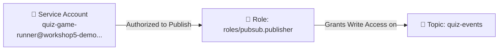

# Google Cloud Run Deployment Guide

This guide details how to build, containerize, and deploy the RPG Quiz Game service to Google Cloud Run, and configure the necessary IAM permissions to allow the service to publish submissions to Google Cloud Pub/Sub.

---

## 🏗️ Architecture Overview

The system design leverages a serverless container running on Cloud Run which serves the frontend and handles requests. When a user submits a quiz result, the application publishes it to a Pub/Sub topic. Pub/Sub then streams the event output directly into Google BigQuery using its direct-write ingestion subscription.

### System Data Flow

```mermaid
flowchart TD
    subgraph Client Space ["🌐 Client Space"]
        A["🎮 Web Browser (User)"]
    end

    subgraph GCP ["☁️ Google Cloud Platform (Project: workshop5-demo)"]
        subgraph Compute ["🚀 Compute Layer (Fully Managed)"]
            CR["🏃 Cloud Run Service: quiz-game-service\n(Identity: quiz-game-runner SA)"]
        end

        subgraph Messaging ["✉️ Ingestion Layer"]
            PS["🔔 Pub/Sub Topic: quiz-events"]
        end

        subgraph Storage ["📊 Analytics Warehouse"]
            BQ["🗄️ BigQuery Table: quiz_results"]
        end
    end

    A -->|1. Submit Answers (JSON)| CR
    CR -->|2. Publish Payload| PS
    PS -->|3. Direct Write Subscription| BQ

    style A fill:#e1f5fe,stroke:#0288d1,stroke-width:2px,color:#01579b
    style CR fill:#e8f5e9,stroke:#388e3c,stroke-width:2px,color:#1b5e20
    style PS fill:#fff3e0,stroke:#f57c00,stroke-width:2px,color:#e65100
    style BQ fill:#ede7f6,stroke:#512da8,stroke-width:2px,color:#311b92
```

### IAM Permission Boundaries

A dedicated Service Account (SA) `quiz-game-runner` is configured following the Principle of Least Privilege. Only this SA has permission to write to the `quiz-events` topic, preventing access to other topics or services in the project.



---

## 🛠️ Step-by-Step Deployment Instructions

### 1. Set Google Cloud Project & Enable Billing
Ensure you have the target GCP project active in your `gcloud` session.

> [!WARNING]
> Google Cloud Run and Artifact Registry require an active billing account associated with the project. Ensure billing is enabled before starting.

```bash
# Set active project
gcloud config set project workshop5-demo
```

### 2. Enable Required Google APIs
Enable the APIs required to build, store, and run serverless containers.

```bash
gcloud services enable \
    run.googleapis.com \
    artifactregistry.googleapis.com \
    cloudbuild.googleapis.com
```

### 3. Create Artifact Registry Repository
Create a repository of type Docker in Artifact Registry for hosting container images.

```bash
gcloud artifacts repositories create quiz-repo \
    --repository-format=docker \
    --location=us-central1 \
    --description="Docker repository for quiz game"
```

### 4. Create Run Service Identity (Service Account)
Create the IAM service account that the Cloud Run service will use as its security identity.

```bash
gcloud iam service-accounts create quiz-game-runner \
    --description="Service account for running the Quiz Game App on Cloud Run" \
    --display-name="Quiz Game Runner"
```

### 5. Grant Permissions to the Service Account
Bind the `Pub/Sub Publisher` role to the service account on the specific `quiz-events` topic.

```bash
gcloud pubsub topics add-iam-policy-binding quiz-events \
    --member="serviceAccount:quiz-game-runner@workshop5-demo.iam.gserviceaccount.com" \
    --role="roles/pubsub.publisher"
```

---

## 🚀 Build and Deployment Methods

Choose one of the two methods below to build the container and deploy it to Cloud Run.

### Method A: Build and Deploy via Cloud Build (Serverless & Recommended)
This method is recommended as it does not require a local Docker installation. It sends the files to Google Cloud Build, which builds and pushes the image automatically.

#### Step 1: Submit build job to Cloud Build
```bash
gcloud builds submit --tag us-central1-docker.pkg.dev/workshop5-demo/quiz-repo/quiz-game:latest
```

#### Step 2: Deploy image to Cloud Run
```bash
gcloud run deploy quiz-game-service \
    --image=us-central1-docker.pkg.dev/workshop5-demo/quiz-repo/quiz-game:latest \
    --region=us-central1 \
    --service-account=quiz-game-runner@workshop5-demo.iam.gserviceaccount.com \
    --set-env-vars=GCP_PROJECT_ID=workshop5-demo,PUBSUB_TOPIC=quiz-events \
    --allow-unauthenticated
```
> [!NOTE]
> The `--allow-unauthenticated` flag is critical as it instructs Google Cloud to allow public, unauthorized HTTP traffic to reach your container.
>
> If you have already deployed the service and want to enable unauthenticated access afterwards, use this command:
> ```bash
> gcloud run services add-iam-policy-binding quiz-game-service \
>     --region=us-central1 \
>     --member="allUsers" \
>     --role="roles/run.invoker"
> ```
*(Note: Replace `--service-account` email if you used a different name. The container runs on port 8080 by default, which Cloud Run automatically configures).*

---

### Method B: Local Docker Build and Push
This method builds the image locally using your local Docker daemon and pushes it to the remote registry.

#### Step 1: Configure local Docker with GCP authentication
```bash
gcloud auth configure-docker us-central1-docker.pkg.dev
```

#### Step 2: Build the Container Image
```bash
docker build -t quiz-game .
```

#### Step 3: Tag and Push to Artifact Registry
```bash
docker tag quiz-game us-central1-docker.pkg.dev/workshop5-demo/quiz-repo/quiz-game:latest
docker push us-central1-docker.pkg.dev/workshop5-demo/quiz-repo/quiz-game:latest
```

#### Step 4: Deploy the image to Cloud Run
```bash
gcloud run deploy quiz-game-service \
    --image=us-central1-docker.pkg.dev/workshop5-demo/quiz-repo/quiz-game:latest \
    --region=us-central1 \
    --service-account=quiz-game-runner@workshop5-demo.iam.gserviceaccount.com \
    --set-env-vars=GCP_PROJECT_ID=workshop5-demo,PUBSUB_TOPIC=quiz-events \
    --allow-unauthenticated
```

---

## 🔍 Validation Checklist

To confirm the service is deployed and has the required permissions:

1. **Verify service account permissions on the topic:**
   ```bash
   gcloud pubsub topics get-iam-policy quiz-events
   ```
   Ensure `serviceAccount:quiz-game-runner@workshop5-demo.iam.gserviceaccount.com` is listed under the `roles/pubsub.publisher` binding.

2. **Verify Cloud Run configuration:**
   ```bash
   gcloud run services describe quiz-game-service --region=us-central1
   ```
   Ensure the active service account is `quiz-game-runner` and environment variables `GCP_PROJECT_ID` and `PUBSUB_TOPIC` are set.
