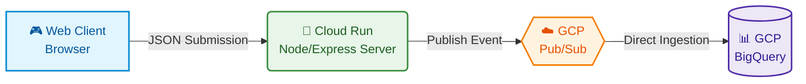

# Data Engineer Quiz Game (RPG Edition)

An interactive web-based game styled as a light novel RPG that quizzes students on Data Engineering concepts (SQL, Data Modeling, ETL pipelines, real-time streaming, and cloud warehousing). The rabbit avatar grows and levels up (from Level 1 to 10) as they clear quests.

The application automatically collects attempt data and publishes it to a Google Cloud Pub/Sub topic, which streams directly into a BigQuery table using direct push ingestion.

### Architecture



---

## 🛠️ GCP Infrastructure Setup

Follow these steps to manually prepare your BigQuery dataset, table, and Pub/Sub resources using the provided `schema.json` file.

### 1. Set Your GCP Project
Ensure you are using the correct GCP project ID (e.g., `workshop5-demo`):
```bash
gcloud config set project workshop5-demo
```

### 2. Create the BigQuery Dataset
Create the `quiz_dataset` in the `US` multi-region (or specify your preferred location):
```bash
bq mk --dataset --location=US workshop5-demo:quiz_dataset
```

### 3. Create the BigQuery Table using the Schema File
Use the project's [schema.json](schema.json) file to create the `quiz_results` table:
```bash
bq mk --table workshop5-demo:quiz_dataset.quiz_results schema.json
```

### 4. Create the Pub/Sub Topic
Create the Pub/Sub topic that the Express application will publish events to:
```bash
gcloud pubsub topics create quiz-events
```

### 5. Setup BigQuery Direct Ingestion Subscription
Grant the Pub/Sub Service Account permission to write to BigQuery, and then create the ingestion subscription.

First, fetch your project number and grant IAM permissions:
```bash
# Get project number
PROJECT_NUMBER=$(gcloud projects describe workshop5-demo --format="value(projectNumber)")

# Grant BigQuery Data Editor role
gcloud projects add-iam-policy-binding workshop5-demo \
    --member="serviceAccount:service-$PROJECT_NUMBER@gcp-sa-pubsub.iam.gserviceaccount.com" \
    --role="roles/bigquery.dataEditor"

# Grant BigQuery Metadata Viewer role
gcloud projects add-iam-policy-binding workshop5-demo \
    --member="serviceAccount:service-$PROJECT_NUMBER@gcp-sa-pubsub.iam.gserviceaccount.com" \
    --role="roles/bigquery.metadataViewer"
```

Next, create the BigQuery push subscription:
```bash
gcloud pubsub subscriptions create quiz-events-bq-sub \
    --topic=quiz-events \
    --bigquery-table="workshop5-demo:quiz_dataset.quiz_results" \
    --use-topic-schema \
    --drop-unknown-fields
```

---

## 🚀 Running the Project

### Local Development
1. Install dependencies:
   ```bash
   npm install
   ```
2. Start the Express server:
   ```bash
   npm run dev
   ```
3. Open your browser to `http://localhost:8080`.

### Containerized Deployment (Single Container)
For running the container locally:
Build the Docker image:
```bash
docker build -t data-engineer-quiz .
```

Run the container locally:
```bash
docker run -p 8080:8080 \
  -e GCP_PROJECT_ID=workshop5-demo \
  -e PUBSUB_TOPIC=quiz-events \
  -v ~/.config/gcloud:/root/.config/gcloud \
  data-engineer-quiz
```

### Google Cloud Run Deployment
For detailed instructions on setting up Google Cloud IAM permissions and deploying this service in a production-ready serverless environment on Cloud Run, please refer to the [DEPLOY.md](DEPLOY.md) file.

### 🇹🇭 สรุปขั้นตอนการ Deploy บน Google Cloud Run (ภาษาไทย)
แอปพลิเคชันนี้โฮสต์อยู่บน Google Cloud Run แบบ Serverless โดยส่งผลคะแนนการทำควิซไปยัง Pub/Sub และไหลเข้าสู่ BigQuery โดยตรง

**ขั้นตอนหลักในการจัดการสิทธิ์และการติดตั้ง:**
1. **เตรียมโครงการ (GCP Project):** ตั้งค่าโครงการหลัก (`workshop5-demo`) และเปิดระบบชำระเงิน (Billing) ให้เรียบร้อย
2. **สร้าง Service Account:** ทำการสร้างบัญชีบริการ `quiz-game-runner` เพื่อให้ Cloud Run นำไปใช้เป็นสิทธิ์ประจำตัว (Identity)
3. **เปิดสิทธิ์การส่งข้อมูล:** ให้สิทธิ์ `roles/pubsub.publisher` (ผู้ส่งข้อมูล Pub/Sub) แก่ Service Account ข้างต้นสำหรับ Topic `quiz-events`
4. **สร้าง Docker Repository:** สร้างพื้นที่จัดเก็บบน Google Artifact Registry
5. **Build และติดตั้ง (Deploy):**
   - คอมไพล์ Docker Image และ Push ขึ้นไปเก็บไว้ที่ Artifact Registry
   - สั่งติดตั้งขึ้น Cloud Run โดยผูกเข้ากับ Service Account ที่เตรียมไว้ และเปิดสิทธิ์การเข้าถึงแบบสาธารณะ (`--allow-unauthenticated`)

สำหรับคำสั่ง command line ทั้งหมดและรายละเอียดสิทธิ์ IAM สามารถศึกษาต่อได้จากคู่มือ **[DEPLOY.md](DEPLOY.md)**

---

## 📊 BigQuery Data Schema

The schema is defined in [schema.json](schema.json). Columns match the JSON message payload fields:

* `session_id` (STRING): Unique identifier for each quiz attempt.
* `student_id` (STRING): The student's unique ID.
* `student_name` (STRING): The student's display name.
* `score` (INTEGER): Number of correct answers (out of 10).
* `total_questions` (INTEGER): Total number of questions.
* `percentage` (FLOAT): Accuracy percentage (e.g. `80.0`).
* `submitted_at` (TIMESTAMP): Time of submission.
* `answers_json` (STRING): Detailed JSON payload of all question evaluations.
